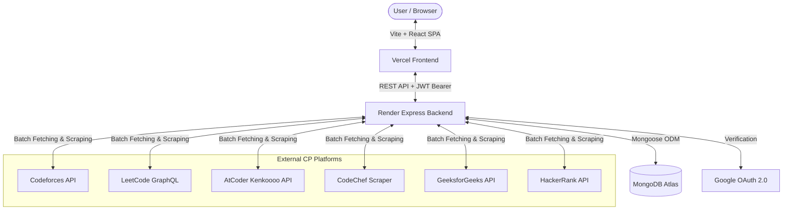

# ⚡ AlgoTracker

<div align="center">


**The Ultimate Real-Time Multi-Platform Competitive Programming Hub & Problem Tracker**

[](https://nodejs.org/)
[](https://reactjs.org/)
[](https://vitejs.dev/)
[](https://expressjs.com/)
[](https://www.mongodb.com/)
[](https://developers.google.com/identity)
[](https://opensource.org/licenses/MIT)

[Features](#-key-features) • [Charts & Visuals](#-interactive-charts--analytics) • [Architecture](#-system-architecture) • [Quick Start](#-quick-start) • [Deployment](#-deployment-render--vercel) • [API Reference](#-api-endpoints)

</div>

---

## 🌟 Overview

**AlgoTracker** is a unified, real-time analytics and tracking engine for competitive programmers and software engineers. It aggregates your solved problems, contest ratings, streaks, and progress across **Codeforces**, **LeetCode**, **AtCoder**, **CodeChef**, **GeeksforGeeks**, and **HackerRank** into one centralized, dashboard with real-time sync.

```
                  ┌─────────────────────────────────────────────────────────┐
                  │                 🌐 AlgoTracker Hub                       │
                  └────────────────────────────┬────────────────────────────┘
                                               │
       ┌──────────────┬──────────────┬─────────┴────┬──────────────┬──────────────┐
       ▼              ▼              ▼              ▼              ▼              ▼
 🏆 Codeforces   ⚡ LeetCode    🎯 AtCoder    👨‍🍳 CodeChef   💻 GeeksforGeeks  🥋 HackerRank
```

---

## ✨ Key Features

### 1. 🔄 Real-Time Tab Auto-Sync & Confetti Alerts
- **Zero Refresh Required**: When you solve a problem on Codeforces or LeetCode in another tab and switch back to AlgoTracker, the live window event listener automatically fetches your newest submissions.
- **Celebration Feedback**: Live confetti blast (`canvas-confetti`) with toast notification celebrating newly accepted problems and rating increases.

### 2. 🔐 Google OAuth 2.0 Only Authentication
- **Secure Single Sign-On**: No passwords or registration forms. Users sign in with their verified Google identity.
- **Handle Binding**: Locks CP platform handles to your Google account, preventing profile tampering.

### 3. 🛡️ Zero LocalStorage Security Architecture
- All user profiles, solved problem caches, bookmarks, editorial notes, and POTD streaks are stored exclusively in **MongoDB**.
- `localStorage` holds zero sensitive data.

### 4. 👑 Superuser Admin Console & Universal Handle Explorer
- Configure `ADMIN_EMAIL` with your Google email to gain root administrator privileges.
- **Universal Handle Explorer**: Inspect any competitive programmer on earth on-the-fly without changing your account binding.
- **User Directory**: View registered users, bound accounts, and manage database records.

### 5. 📅 Contests Hub & Daily POTD Engine
- Aggregates upcoming contest schedules across all major platforms with direct contest links and countdown timers.
- Integrated **Problem of the Day (POTD)** tracker with daily check-ins and streak counters.

---

## 📊 Interactive Charts & Analytics

AlgoTracker provides deep visual performance analysis powered by **Chart.js** & **React-Chartjs-2**:

```
 ┌─────────────────────────────────────────────────────────────────────────────┐
 │ 📈 MULTI-PLATFORM ANALYTICS DASHBOARD                                       │
 ├──────────────────────────────────────┬──────────────────────────────────────┤
 │ 🍩 Platform Distribution             │ 📊 Difficulty Breakdown              │
 │  • Codeforces: 52%                   │  • Easy / 800-1100:   ■■■■■■■■ (320) │
 │  • LeetCode:   31%                   │  • Medium / 1200-1600: ■■■■■■   (240) │
 │  • AtCoder:    12%                   │  • Hard / 1700+:      ■■■      (110) │
 │  • Others:      5%                   │                                      │
 ├──────────────────────────────────────┴──────────────────────────────────────┤
 │ 📈 Rating Progression Timeline & Submission Activity                        │
 │  [~~~~~~~~~~~~~~~~~~~~~~~~/^\~~~~~~~~~~~~~/\~~~~~~~~~~~~~~~~~~~~~~~~~~~~~]  │
 └─────────────────────────────────────────────────────────────────────────────┘
```

### Supported Visualizations:
- 📊 **Platform Solved Distribution** (Doughnut Chart): Solved problem percentage across Codeforces, LeetCode, AtCoder, CodeChef, and GFG.
- 📉 **Rating Trend & History** (Smooth Curved Line Chart): Contest rating evolution over time with custom platform color markers.
- 🎯 **Difficulty Matrix** (Stacked Bar Chart): Breakdown across Easy / Medium / Hard and Codeforces numerical difficulty buckets (800 - 3500).
- 🔥 **Streak & Consistency Heatmap**: Daily solve frequency and active coding day streaks.

---

## 🏗️ System Architecture



---

## 📁 Repository Structure

```
algotracker/
├── client/                     # Frontend Vite + React SPA
│   ├── src/
│   │   ├── components/         # React UI Components
│   │   │   ├── Navbar.jsx      # Sticky Glassmorphic Navigation
│   │   │   ├── Dashboard.jsx   # Stats, Highlights & Quick Actions
│   │   │   ├── ProblemTracker.jsx # Searchable & Filterable Problem Table
│   │   │   ├── AnalyticsView.jsx  # Chart.js Visualizations
│   │   │   ├── ContestsHub.jsx    # Live & Upcoming Contests Calendar
│   │   │   ├── POTDHub.jsx        # Problem of the Day Hub
│   │   │   ├── AdminPanel.jsx     # Universal Handle Explorer & User DB
│   │   │   ├── AuthModal.jsx      # Google OAuth 2.0 Sign-In Modal
│   │   │   ├── HandleModal.jsx    # Platform Handle Configuration
│   │   │   ├── WelcomeLanding.jsx # Landing Screen for Logged-Out State
│   │   │   └── LiveNotificationToast.jsx # Real-time solve celebration
│   │   ├── services/
│   │   │   └── api.js          # Dynamic API proxy (Vercel -> Render)
│   │   ├── App.jsx             # Root State & Real-Time Sync Orchestration
│   │   ├── index.css           # Premium Dark Slate Glassmorphism Theme
│   │   └── main.jsx
│   ├── index.html              # HTML5 Shell + Google Identity Services SDK
│   ├── package.json
│   ├── vercel.json             # Vercel SPA Routing Configuration
│   └── vite.config.js
│
├── server/                     # Backend Express.js API
│   ├── config/
│   │   └── db.js               # MongoDB Adapter + Local JSON Fallback DB
│   ├── middleware/
│   │   └── auth.js             # JWT Verification & Superuser Admin Guard
│   ├── models/
│   │   ├── User.js             # MongoDB User Schema (Google ID + Handles)
│   │   └── Problem.js          # Solved Problems Schema with Indexing
│   ├── routes/
│   │   ├── auth.js             # Google OAuth & Profile Sync Endpoints
│   │   ├── sync.js             # Aggregated Platform Sync Route
│   │   ├── admin.js            # Universal Explorer & User Directory Routes
│   │   ├── contests.js         # Contest Schedule Fetcher
│   │   └── potd.js             # Daily Coding Challenges
│   ├── services/
│   │   ├── codeforcesService.js # Full CF Submission History Fetcher
│   │   ├── leetcodeService.js   # GraphQL Scraper for LeetCode Stats
│   │   ├── atcoderService.js    # Kenkoooo API Pagination
│   │   ├── codechefService.js   # CodeChef Scraper
│   │   ├── gfgService.js        # GeeksforGeeks Solved Stats
│   │   └── hackerrankService.js # HackerRank Scraper
│   ├── index.js                # Express App Entrypoint
│   ├── .env                    # Environment Configuration (Git-ignored)
│   ├── .env.example            # Environment Template
│   └── package.json
│
├── .gitignore                  # Production Git Ignore for Vercel/Render
├── DEPLOYMENT.md               # Step-by-Step Cloud Deployment Guide
└── package.json                # Root package for Monorepo scripts
```

---

## 🚀 Quick Start

### Prerequisites
- [Node.js](https://nodejs.org/) `>= 18.0.0`
- [MongoDB Atlas](https://www.mongodb.com/atlas) account (or use the built-in local JSON fallback)
- [Google Cloud Console](https://console.cloud.google.com/) OAuth 2.0 Client ID

### 1. Clone & Install Dependencies
```bash
git clone https://github.com/your-username/algotracker.git
cd algotracker

# Install all dependencies (root, server, and client)
npm run postinstall
```

### 2. Configure Environment Variables
Create a `.env` file in the `server/` directory:

```bash
cp server/.env.example server/.env
```

Edit `server/.env`:
```env
PORT=5000
MONGODB_URI=mongodb+srv://<username>:<password>@cluster0.xxxxx.mongodb.net/algotracker?retryWrites=true&w=majority&appName=algotracker
JWT_SECRET=your_super_secret_jwt_key_2026
GOOGLE_CLIENT_ID=your_google_client_id.apps.googleusercontent.com
ADMIN_EMAIL=your_email@gmail.com
```

### 3. Run Locally
```bash
# Terminal 1: Start Backend (Port 5000)
npm run server

# Terminal 2: Start Frontend (Port 3000)
npm run client
```

Open [http://localhost:3000](http://localhost:3000) in your browser!

---

## 🌐 Deployment (Render + Vercel)

AlgoTracker is pre-configured for deployment with **Render (Backend)** and **Vercel (Frontend)**.

### Step 1: Deploy Backend on Render
1. Create a new **Web Service** on [Render.com](https://render.com/).
2. Set **Root Directory** to `server`.
3. Set **Build Command** to `npm install` and **Start Command** to `npm start`.
4. Add environment variables (`MONGODB_URI`, `JWT_SECRET`, `GOOGLE_CLIENT_ID`, `ADMIN_EMAIL`).
5. Copy your Render service URL (e.g. `https://algotracker-api.onrender.com`).

### Step 2: Deploy Frontend on Vercel
1. Create a new project on [Vercel.com](https://vercel.com/).
2. Set **Root Directory** to `client`.
3. Set **Framework Preset** to `Vite`.
4. Add Environment Variable:
   - `VITE_API_URL` = `https://algotracker-api.onrender.com`
5. Click **Deploy**!

> Full step-by-step instructions with Google OAuth origins are in [DEPLOYMENT.md](file:///c:/Harshil%20programming/code/New%20folder/DEPLOYMENT.md).

---

## 📡 API Endpoints

### 🔐 Authentication (`/api/auth`)
| Method | Endpoint | Description | Access |
| :--- | :--- | :--- | :--- |
| `POST` | `/api/auth/google` | Google OAuth verification & token generation | Public |
| `GET` | `/api/auth/me` | Fetch authenticated user profile from MongoDB | User / Admin |
| `POST` | `/api/auth/update-handles` | Bind platform handles to Google profile | User / Admin |
| `POST` | `/api/auth/sync-user-state` | Sync notes, bookmarks, and POTD completions | User / Admin |

### 🔄 Problem Sync & Data (`/api`)
| Method | Endpoint | Description | Access |
| :--- | :--- | :--- | :--- |
| `POST` | `/api/sync` | Aggregate and fetch full submission history | User / Admin |
| `GET` | `/api/contests` | Upcoming & live CP contest calendar | Public |
| `GET` | `/api/potd` | Problem of the Day cross-platform feed | Public |

### 🛡️ Admin Superuser (`/api/admin`)
| Method | Endpoint | Description | Access |
| :--- | :--- | :--- | :--- |
| `GET` | `/api/admin/status` | Database health, total users, problem count | Superuser |
| `GET` | `/api/admin/users` | List all registered users and bound handles | Superuser |
| `DELETE` | `/api/admin/user/:id` | Remove a user and associated data from MongoDB | Superuser |

---

## 🛡️ Privacy & Security

- **No Passwords Stored**: Users authenticate directly using Google's secure OAuth 2.0 flow.
- **Zero LocalStorage Policy**: No handles, notes, or solved problems are cached in browser localStorage.
- **Protected Secrets**: `.env`, private keys, local databases, and debug logs are blocked via [.gitignore](file:///c:/Harshil%20programming/code/New%20folder/.gitignore).

---

## 📄 License

This project is licensed under the **MIT License** - see the [LICENSE](LICENSE) file for details.
